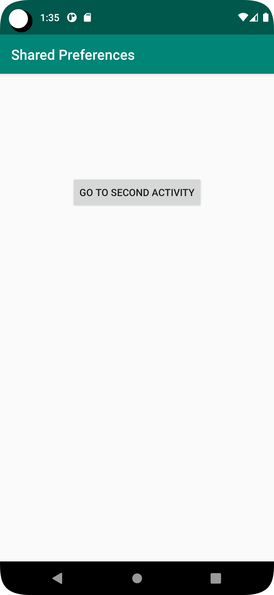
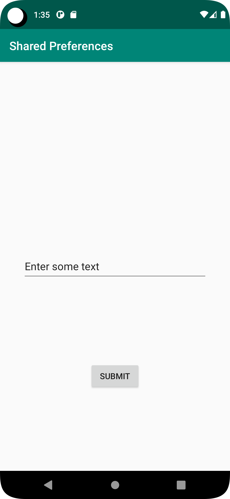
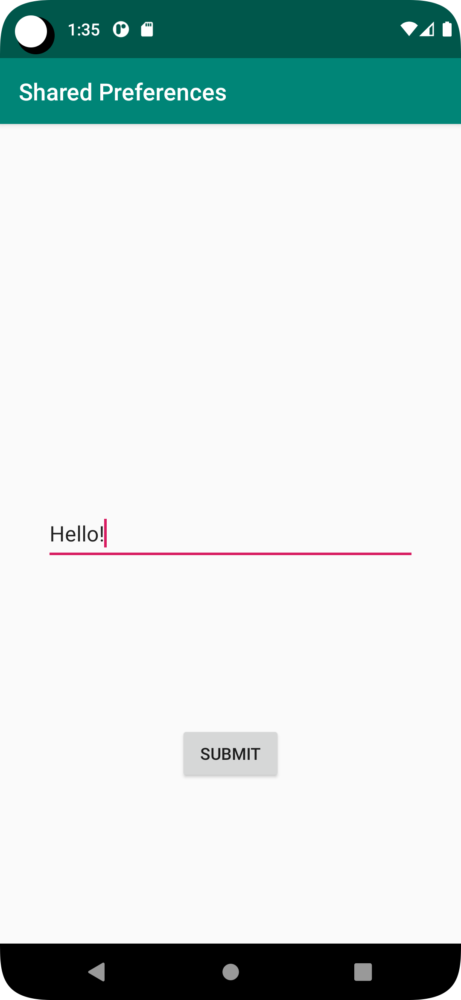
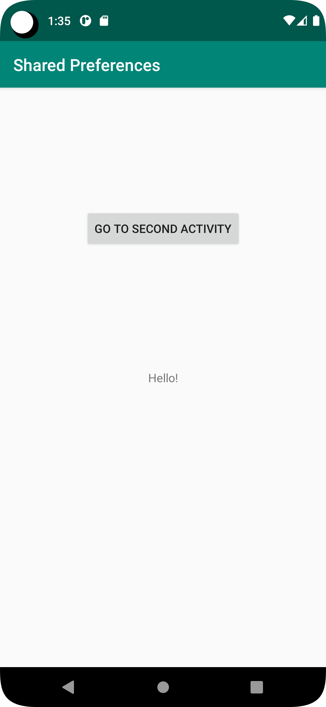

# Rapport

För att dela data skapades SharedPreferences inom MainActivity.java som sedan instansieras i OnCreate().

För att kunna öppna en ny skärm skapades "SecondActivity" och en knapp för att öppna den.

Inom SecondActivity behövs texten från EditText sparas i sharedPreferences för att kunna delas
med MainActivity, genom att spara EditText innehållet som en string och mata in det i filen
"myPreferenceRef" kan innehållet nås inom MainActivity:

    EditText editText = findViewById(R.id.editText);
    String text = editText.getText().toString();

    SharedPreferences sharedPreferences = getSharedPreferences("myPreferenceRef", MODE_PRIVATE);
    SharedPreferences.Editor editor = sharedPreferences.edit();
    editor.putString("MyAppPreferenceString", text);
    editor.apply();

Nu kan strängen nås inom MainActivty genom att öppna filen:

    private SharedPreferences myPreferenceRef;
    myPreferenceRef = getSharedPreferences("myPreferenceRef", MODE_PRIVATE);

Och sedan ersätta textView genom att använda rätt nyckel för strängen och ändra texten:

    TextView textView = findViewById(R.id.textView);
    textView.setText(myPreferenceRef.getString("MyAppPreferenceString", ""));

{ width=25% }

{ width=25% }

{ width=25% }

{ width=25% }

